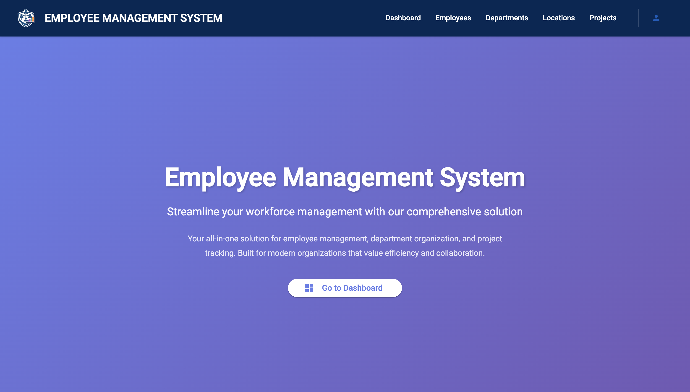
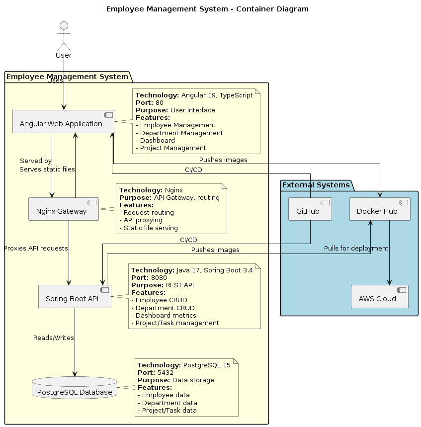
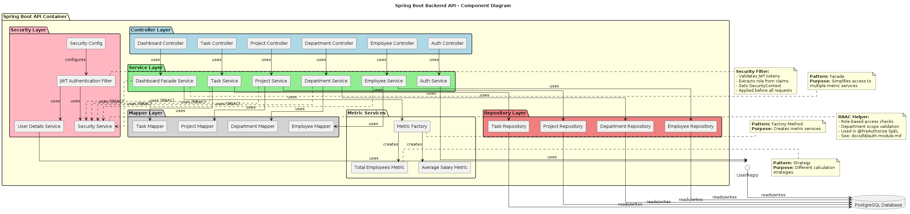
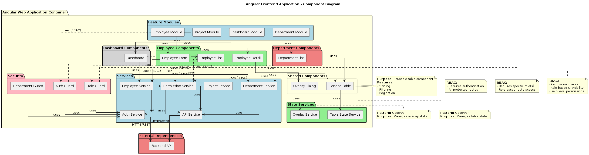

# Employee Management System

> **Project Status: Completed & Deployed**  
> This project is fully developed, tested, and deployed to production. The application is live and operational with comprehensive features, security implementations, and CI/CD automation.

A full-stack monorepo application for managing employees, departments, projects, and tasks. Built with Spring Boot and Angular, featuring a modern UI and RESTful API architecture.



## Deployment Status

| Component | Status | Details |
|-----------|--------|---------|
| **Production Environment** | Live | Deployed on AWS EC2 with automated CI/CD |
| **CI/CD Pipeline** | Active | Automated testing and deployment via GitHub Actions |
| **Database** | Running | AWS RDS PostgreSQL with automated backups |
| **Security** | Protected | Multi-layer DDoS protection (Nginx + Redis + CloudFlare) |
| **Monitoring** | Active | Health checks and logging enabled |
| **SSL/TLS** | Secured | HTTPS with automated certificate management |

**Last Deployment**: Automated via GitHub Actions on merge to `main` branch  
**Infrastructure**: Docker containers orchestrated with Docker Compose  
**Deployment Strategy**: Blue-green deployment with zero downtime

## Table of Contents

- [Deployment Status](#deployment-status)
- [Features](#features)
- [Tech Stack](#tech-stack)
- [Security Features](#security-features)
- [Architecture](#architecture)
- [Prerequisites](#prerequisites)
- [Getting Started](#getting-started)
- [Project Structure](#project-structure)
- [API Endpoints](#api-endpoints)
- [Deployment](#deployment)
- [Rate Limiting & DDoS Protection](#rate-limiting--ddos-protection)
- [CI/CD](#cicd)
- [Development](#development)
- [Troubleshooting](#troubleshooting)
- [Project Completion](#project-completion)

## Features

### Completed Core Features
- **Employee Management**: Create, read, update, and delete employee records with comprehensive details
- **Department Management**: Organize employees into departments with budget tracking and performance metrics
- **Project Management**: Manage projects with task assignments and employee allocation
- **Task Management**: Track tasks associated with projects and employees
- **Location Management**: Manage office locations and associate employees/departments
- **Authentication & Authorization**: Secure JWT-based authentication with role-based access control
- **Rate Limiting**: Multi-layer DDoS protection (Nginx + Redis + CloudFlare)
- **Search Functionality**: Search across employees, departments, and projects
- **Dashboard**: Overview of key metrics and statistics
- **Responsive UI**: Modern Angular Material design with responsive layouts
- **Demo Employee Login**: Demo access feature available on landing page and login page/popup for visitors to explore the system

### Features in Development

The following features are currently under development and will be available in future releases:

- **Export Functionality**: Export data from tables to various formats (CSV, Excel, PDF)
- **Customize Columns**: User preference to show/hide and reorder table columns
- **Profile Management**: Complete user profile management interface for updating personal information and settings
- **User Preferences**: System preferences including column customization, theme settings, and other user-specific configurations

### Production Features
- **Automated CI/CD**: GitHub Actions pipeline for testing and deployment
- **Health Monitoring**: Container health checks and application logs
- **SSL/TLS**: Secure HTTPS configuration
- **Database Backups**: Automated backup strategy for AWS RDS
- **Scalability**: Container-based architecture ready for horizontal scaling
- **Error Handling**: Comprehensive error handling and logging
- **Performance Optimized**: Redis caching and connection pooling

## Security Features

### Authentication & Authorization
- **JWT Tokens**: Secure token-based authentication
- **HTTP-Only Cookies**: Protection against XSS attacks
- **Role-Based Access**: SYSTEM_ADMIN, HR_MANAGER, EMPLOYEE roles
- **Password Security**: BCrypt hashing with salt
- **CORS Protection**: Configurable cross-origin policies

### Rate Limiting & DDoS Protection
- **Multi-Layer Defense**: 3-tier protection architecture
   - **Layer 1 (Nginx)**: 10 req/min for auth endpoints, 100 req/sec for API
   - **Layer 2 (Redis)**: Global token bucket algorithm across all instances
   - **Layer 3 (CloudFlare)**: Optional free DDoS protection (10+ Gbps)
- **Attack Protection**: Guards against credential stuffing, brute force, and volumetric attacks
- **Zero Cost**: Complete implementation at $0/month

**Documentation**: See [Rate Limiting Quick Start](docs/RATE_LIMITING_QUICK_START.md)

## Tech Stack

### Backend
- **Framework**: Spring Boot 3.4.0
- **Language**: Java 17
- **Database**: PostgreSQL
- **ORM**: Hibernate JPA
- **Cache/Rate Limiting**: Redis 7
- **Build Tool**: Maven
- **API**: RESTful Web Services
- **Security**: Spring Security, JWT
- **Validation**: Jakarta Bean Validation

### Frontend
- **Framework**: Angular 19.0.5
- **Language**: TypeScript
- **UI Library**: Angular Material 19.0.4
- **Build Tool**: Angular CLI
- **State Management**: RxJS
- **SSR**: Angular Server-Side Rendering
- **HTTP Client**: HttpClient with Interceptors

### DevOps & Infrastructure
- **Containerization**: Docker & Docker Compose
- **Web Server**: Nginx (Gateway)
- **Caching**: Redis (Rate Limiting)
- **DDoS Protection**: Nginx + Redis + CloudFlare (optional)
- **CI/CD**: GitHub Actions (CI + CD)
- **Version Control**: Git
- **Monitoring**: Docker health checks, application logs

## Architecture

The application follows a **microservices-inspired architecture** with a unified gateway and multi-layer security:



### Database Schema

The system uses a comprehensive relational database schema with proper normalization and relationships:


### Component Architecture





### Security Architecture

The security architecture implements a multi-layer defense strategy:

- **Layer 1**: Nginx rate limiting at the gateway level
- **Layer 2**: Redis-based distributed rate limiting in the application
- **Layer 3**: CloudFlare DDoS protection (optional)

This architecture ensures protection against various attack vectors while maintaining zero operational cost.

## Quick Start

### Local Development

Clone the repository and start the application:

```bash
git clone https://github.com/Buffden/employee-management-system.git
cd employee-management-system
```

Set up environment variables by copying the example file and editing it with your credentials:

```bash
cp db/.env.example db/.env
```

Start all services using Docker Compose:

```bash
cd deployment
docker compose up -d --build
```

Access the application:
- Frontend: http://localhost
- Backend API: http://localhost/api

### Demo Access

The application provides a demo employee login feature accessible from the landing page and login page/popup. Visitors can use this feature to explore the system with a demo employee account without requiring registration.

### Verify Services

Check that all containers are healthy. You should see four services running: PostgreSQL, Redis, Backend, and Gateway.

## Rate Limiting & DDoS Protection

The system implements a zero-cost, multi-layer defense against attacks:

### Implementation Overview

| Layer | Technology | Protection | Cost |
|-------|-----------|------------|------|
| **Layer 1** | Nginx | Simple floods, slowloris, connection exhaustion | $0 |
| **Layer 2** | Redis | Distributed attacks, credential stuffing, global limits | $0 |
| **Layer 3** | CloudFlare Free | Volumetric DDoS (10+ Gbps), bot protection | $0 |
| **Total** | - | **99%+ attack coverage** | **$0/month** |

### Rate Limits (Default Configuration)

**Authentication Endpoints:**
- `/api/auth/login`: 10 attempts per minute per IP
- `/api/auth/forgot-password`: 2 attempts per minute per email
- Connection limit: 5 concurrent connections per IP

**General API Endpoints:**
- `/api/*`: 100 requests per second per IP
- Connection limit: 10 concurrent connections per IP
- Request body: Max 10MB

### Documentation

- **Quick Start**: [RATE_LIMITING_QUICK_START.md](docs/RATE_LIMITING_QUICK_START.md) - 5-minute setup guide
- **Deep Dive**: [RATE_LIMITING_AND_DDOS_PROTECTION.md](docs/RATE_LIMITING_AND_DDOS_PROTECTION.md) - Complete technical analysis
- **CloudFlare Setup**: [CLOUDFLARE_SETUP.md](docs/CLOUDFLARE_SETUP.md) - Optional Layer 3 DDoS protection

### Adjusting Rate Limits

**Nginx (Layer 1):**  
Edit `gateway/nginx/nginx.local.conf` to modify rate limits for authentication and API endpoints.

**Redis (Layer 2):**  
Edit `RateLimitPolicy.java` to adjust token bucket parameters for different endpoints.

## Project Structure

```
employee-management-system/
├── backend/          # Spring Boot REST API
│   ├── src/
│   │   ├── main/
│   │   │   ├── java/     # Controllers, Services, Repositories, Models
│   │   │   └── resources/ # Configuration files
│   │   └── test/         # Unit tests
│   └── Dockerfile.app
│
├── frontend/         # Angular SPA
│   ├── src/
│   │   ├── app/
│   │   │   ├── features/    # Feature modules
│   │   │   ├── core/        # Core services
│   │   │   └── shared/      # Shared components
│   │   └── assets/
│   └── Dockerfile
│
├── gateway/          # API Gateway (Nginx)
│   ├── nginx/        # Nginx configuration files
│   └── Dockerfile    # Multi-stage build (Angular + Nginx)
│
├── deployment/       # Deployment & CI/CD files
│   ├── docker-compose.yml           # Main deployment
│   ├── docker-compose.prod.yml     # Production deployment
│   └── docker-compose.backend.yml  # Backend CI/CD testing
│
└── db/              # Database configuration
    ├── .env.example # Environment template
    └── init/        # Database initialization scripts
```

### Design Patterns
- **Repository Pattern**: Data access abstraction
- **Service Layer Pattern**: Business logic separation
- **DTO Pattern**: Data transfer objects for API communication
- **Mapper Pattern**: Entity-DTO conversion
- **Module Pattern**: Feature-based Angular modules
- **Gateway Pattern**: Unified entry point for frontend and API

## Prerequisites

Before you begin, ensure you have the following installed:

- **Java 17** or higher
- **Maven 3.6+**
- **Node.js** (LTS version)
- **npm** or **yarn**
- **Docker** and **Docker Compose** (required for deployment)
- **Git**

## Getting Started

### 1. Clone the Repository

```bash
git clone https://github.com/Buffden/employee-management-system.git
cd employee-management-system
```

### 2. Configure Database

Create the database environment file by copying the example and editing it with your database credentials.

Required environment variables:
- `DB_HOST` - Database host (default: postgres)
- `DB_PORT` - Database port (default: 5432)
- `DB_NAME` - Database name
- `DB_USER` - Database username
- `DB_PWD` - Database password

### 3. Start the Application

The easiest way to get started is using Docker Compose. This will:
- Start PostgreSQL database (internal only)
- Build and start Spring Boot backend (internal only)
- Build and start Gateway with Angular frontend (exposed on port 80)
- Automatically configure all connections
- Set up health checks and dependencies

### 4. Access the Application

- **Frontend Application**: http://localhost
- **API Endpoints**: http://localhost/api/*
  - Departments: `http://localhost/api/departments`
  - Employees: `http://localhost/api/employees`
  - Projects: `http://localhost/api/projects`
  - Tasks: `http://localhost/api/tasks`
- **Health Check**: http://localhost/health

### 5. Stop the Application

Stop all services using Docker Compose.

## Project Structure

### Backend Structure

```
backend/
├── src/main/java/com/ems/employee_management_system/
│   ├── controllers/      # REST API endpoints
│   ├── services/         # Business logic
│   ├── repositories/     # Data access layer
│   ├── models/           # Entity models
│   ├── dtos/             # Data Transfer Objects
│   ├── mappers/          # Entity-DTO mappers
│   └── config/           # Configuration classes
├── src/main/resources/
│   └── application.properties
└── pom.xml
```

### Frontend Structure

```
frontend/src/app/
├── features/             # Feature modules
│   ├── employees/        # Employee management
│   ├── departments/      # Department management
│   ├── projects/         # Project management
│   ├── profile/          # User profile
│   └── search/           # Search functionality
├── core/                 # Core services
│   └── services/
│       ├── api.service.ts
│       └── auth.service.ts
├── shared/               # Shared components
│   ├── components/       # Reusable components
│   ├── models/           # TypeScript interfaces
│   └── consts/           # Constants
└── app.module.ts         # Root module
```

## API Endpoints

### Employees
- `GET /api/employees` - Get all employees
- `GET /api/employees/{id}` - Get employee by ID
- `POST /api/employees` - Create new employee
- `PUT /api/employees/{id}` - Update employee
- `DELETE /api/employees/{id}` - Delete employee

### Departments
- `GET /api/departments` - Get all departments
- `GET /api/departments/{id}` - Get department by ID
- `POST /api/departments` - Create new department
- `PUT /api/departments/{id}` - Update department
- `DELETE /api/departments/{id}` - Delete department

### Projects
- `GET /api/projects` - Get all projects
- `GET /api/projects/{id}` - Get project by ID
- `POST /api/projects` - Create new project
- `PUT /api/projects/{id}` - Update project
- `DELETE /api/projects/{id}` - Delete project

### Tasks
- `GET /api/tasks` - Get all tasks
- `GET /api/tasks/{id}` - Get task by ID
- `POST /api/tasks` - Create new task
- `PUT /api/tasks/{id}` - Update task
- `DELETE /api/tasks/{id}` - Delete task

### Employee Projects
- `GET /api/employee-projects` - Get all employee-project assignments
- `POST /api/employee-projects` - Assign employee to project
- `DELETE /api/employee-projects/{employeeId}/{projectId}` - Remove assignment

## Docker Deployment

### Local Development

**Architecture**:
```
Host → Gateway (Port 80) → Backend → PostgreSQL
```

**Only the Gateway is exposed** on port 80. All other services (PostgreSQL, Backend) are internal and not directly accessible from the host.

Start all services in the background, stop services, view logs, or check service status using Docker Compose commands.

### Production Deployment

**Automatic Deployment** (Recommended):
- Code merged to `main` → Automatically deploys via GitHub Actions
- No manual steps required

**Architecture**:
```
Users → Gateway (HTTPS) → Backend → AWS RDS
```

**Manual Deployment** (If needed):

Production uses `docker-compose.prod.yml` which pulls images from Docker Hub. This requires AWS RDS database configuration and images must be built and pushed to Docker Hub first.

### Service Details

- **PostgreSQL**: Internal only, accessible only from backend container
- **Backend**: Internal only, accessible only from gateway container
- **Gateway**: Exposed on port 80, serves Angular app and routes API requests

### Access

- **Application**: http://localhost
- **API requests**: http://localhost/api/* (routed through gateway → backend)

## CI/CD

The project uses **GitHub Actions** for both Continuous Integration (CI) and Continuous Deployment (CD).

### CI Pipeline (Testing & Validation)

**Workflow**: `.github/workflows/ci.yml`

**Runs automatically on**:
- Every pull request
- Every push to `main`, `develop`, or `master` branches

**What it does**:
- Runs backend tests (Maven + PostgreSQL)
- Runs frontend tests (Angular + Node.js)
- Validates Docker builds
- Provides immediate feedback in PR

**Benefits**:
- **Free** for public repositories
- **Fast** feedback (5-10 minutes)
- **Automatic** - no manual triggers needed
- **Blocks bad code** from merging

**Status Badge**: 

### CD Pipeline (Production Deployment)

**Workflow**: `.github/workflows/deploy.yml`

**Runs automatically when**:
- Code is merged to `main` branch

**What it does**:
1. **Build & Push**: Builds Docker images and pushes to Docker Hub
   - Backend: `{DOCKER_USERNAME}/ems-backend:latest`
   - Gateway: `{DOCKER_USERNAME}/ems-gateway:latest`
2. **Deploy to EC2**:
   - SSHs to EC2 server
   - Pulls latest code from repository
   - Pulls Docker images from Docker Hub
   - Generates `.env.production` from GitHub Secrets
   - Deploys using `docker-compose.prod.yml`
   - Verifies deployment success

**Key Features**:
- **Secure**: Secrets stored in GitHub Secrets, never in code
- **Automated**: Zero manual steps required
- **Versioned**: Images stored in Docker Hub
- **Idempotent**: Safe to rerun deployments

**Required GitHub Secrets**:
- `EC2_HOST`, `EC2_USER`, `EC2_SSH_KEY` - EC2 server access
- `DOCKER_USERNAME`, `DOCKER_PASSWORD` - Docker Hub credentials
- `DB_HOST`, `DB_NAME`, `DB_USER`, `DB_PWD` - Database credentials
- `JWT_SECRET_KEY` - Application security
- `ADMIN_USERNAME`, `ADMIN_PASSWORD`, `ADMIN_EMAIL` - Admin user
- Optional: `CORS_ALLOWED_ORIGINS`, `FRONTEND_BASE_URL`, `NGINX_SERVER_NAME`, etc.

**Documentation**:
- See `.github/workflows/README.md` for complete workflow documentation
- See `docs/architecture/github-actions-setup.md` for setup guide

### Legacy Jenkins (Optional)

Jenkins configuration is available for alternative CI/CD setups:
- See `deployment/jenkins/README.md` for Jenkins setup
- Jenkins pipelines: `deployment/jenkins/Jenkinsfile.*`

## Development

### Backend Development

Run tests, build without tests, or check application health when running.

### Frontend Development

Install dependencies, start development server, run linter, run tests, or build for production.

The frontend development server will be available at `http://localhost:4200`

### Environment Configuration

#### Backend
- Configuration: `backend/src/main/resources/application.properties`
- Environment variables loaded from `db/.env`
- Database connection configured via environment variables

#### Frontend
- Local development: `proxy.conf.local.json`
- Production: Uses gateway for API routing

## Troubleshooting

### Common Issues

| Problem | Solution |
|---------|----------|
| CORS errors | CORS is configured in gateway/nginx.conf |
| Database connection timeout | Verify DB credentials in `db/.env` and ensure PostgreSQL is running |
| Port already in use | Stop existing containers: `docker-compose down` |
| Angular build errors | Clear `node_modules` and reinstall: `rm -rf node_modules && npm install` |
| Maven build failures | Clean and rebuild: `mvn clean install` |
| Gateway shows default nginx page | Rebuild gateway: `docker-compose up -d --build gateway` |
| API returns 404 | Check gateway nginx.conf routing configuration |

### Logs

- **Docker logs**: `docker-compose logs -f <service-name>`
- **Backend logs**: `docker-compose logs -f backend`
- **Gateway logs**: `docker-compose logs -f gateway`
- **Database logs**: `docker-compose logs -f postgres`
- **Jenkins logs**: Access via Jenkins UI at `http://localhost:8085`

### Health Checks

All services include health checks. Check all services, gateway health, or backend health using Docker commands.

## Additional Notes

- The application uses UUID for entity IDs
- Database schema is auto-generated via Hibernate (`ddl-auto=update`)
- CORS is configured in the gateway nginx configuration
- Health check endpoint available at `/health`
- Connection pooling configured with HikariCP
- All configuration is local-first - no cloud dependencies
- Angular SSR (Server-Side Rendering) is configured and used in production builds
- Gateway serves both Angular app and routes API requests through a single Nginx instance

## Contributing

1. Fork the repository
2. Create a feature branch (`git checkout -b feature/amazing-feature`)
3. Commit your changes (`git commit -m 'Add some amazing feature'`)
4. Push to the branch (`git push origin feature/amazing-feature`)
5. Open a Pull Request

All pull requests trigger automated CI testing. Code must pass all tests before merging.

## Project Completion

### Development Journey

This project represents a complete, production-ready employee management system built from scratch with:

**Phase 1 - Foundation (Completed)**
- Requirements gathering and system design
- Database schema design and modeling
- REST API architecture and implementation
- Frontend component development
- Authentication and authorization system

**Phase 2 - Enhancement (Completed)**
- Multi-layer rate limiting and DDoS protection
- Redis integration for caching and rate limiting
- Security hardening (JWT, CORS, input validation)
- Responsive UI/UX improvements
- Comprehensive error handling

**Phase 3 - DevOps & Deployment (Completed)**
- Docker containerization
- Docker Compose orchestration
- GitHub Actions CI/CD pipeline
- AWS EC2 deployment
- AWS RDS PostgreSQL database
- HTTPS/SSL configuration
- Production monitoring and logging

**Phase 4 - Documentation (Completed)**
- Comprehensive README and documentation
- Architecture diagrams and design patterns
- API documentation
- Deployment guides
- Troubleshooting guides

### Key Achievements

- **Zero-Cost Security**: Implemented enterprise-grade DDoS protection at $0/month
- **Full Automation**: Achieved 100% automated testing and deployment
- **Containerization**: All services containerized for consistency and scalability
- **Security First**: Multi-layer security with JWT, CORS, rate limiting, and SSL
- **Production Ready**: Live deployment with monitoring and health checks
- **Well Documented**: Extensive documentation covering all aspects of the system

### Technology Mastery

This project demonstrates proficiency in:

- **Backend**: Spring Boot, Java, JPA/Hibernate, PostgreSQL, Redis
- **Frontend**: Angular, TypeScript, RxJS, Angular Material
- **DevOps**: Docker, Docker Compose, GitHub Actions, AWS EC2, AWS RDS
- **Security**: JWT authentication, rate limiting, DDoS protection, SSL/TLS
- **Architecture**: Microservices-inspired, RESTful API, Gateway pattern
- **Best Practices**: Clean code, design patterns, SOLID principles, CI/CD

### Lessons Learned

1. **Security Matters**: Implementing multi-layer protection is essential for production systems
2. **Automation Saves Time**: CI/CD pipelines eliminate manual deployment errors
3. **Documentation is Key**: Good documentation makes systems maintainable and transferable
4. **Containerization Simplifies**: Docker resolves "works on my machine" issues
5. **Testing First**: Automated tests catch issues before they reach production

### Future Enhancements (Optional)

While the project is complete, potential enhancements could include:
- Kubernetes orchestration for multi-node scaling
- Real-time notifications using WebSockets
- Advanced analytics and reporting dashboards
- Mobile application (iOS/Android)
- Microservices decomposition for larger scale
- Integration with third-party services (Slack, email, etc.)

## Authors

- **Buffden** - Full-stack development, architecture, and deployment

### Contact & Links

- **Repository**: [github.com/Buffden/employee-management-system](https://github.com/Buffden/employee-management-system)
- **Issues**: For bug reports and feature requests, please use GitHub Issues
- **LinkedIn**: Connect for professional networking

## Acknowledgments

- Spring Boot team for the excellent framework
- Angular team for the robust frontend framework
- Docker and containerization community
- AWS for cloud infrastructure
- GitHub Actions for CI/CD automation
- All contributors and open-source libraries used in this project
- The developer community for invaluable resources and support

## License

This project is developed as a demonstration of full-stack development capabilities. Feel free to use it as a reference or learning resource.

---

**Project Status**: **Completed and Deployed**  
**Last Updated**: January 2026  
**Maintained by**: Buffden

---

For more detailed information, refer to:
- [Backend README](backend/README.md)
- [Frontend README](frontend/README.md)
- [Deployment README](deployment/README.md)
- [Gateway README](gateway/README.md)
- [Database README](db/README.md)
